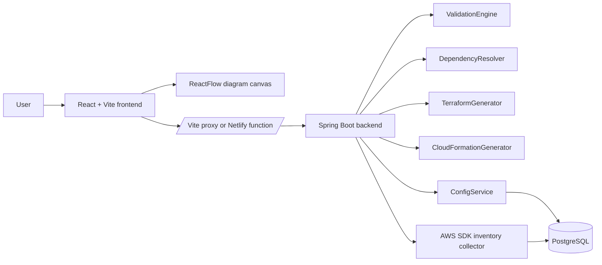
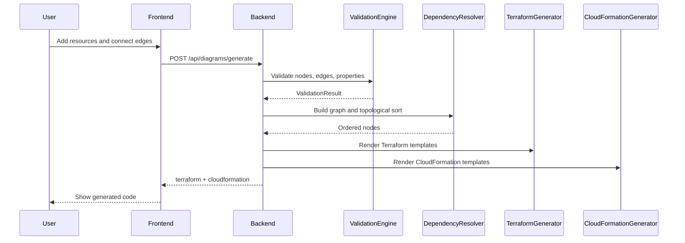
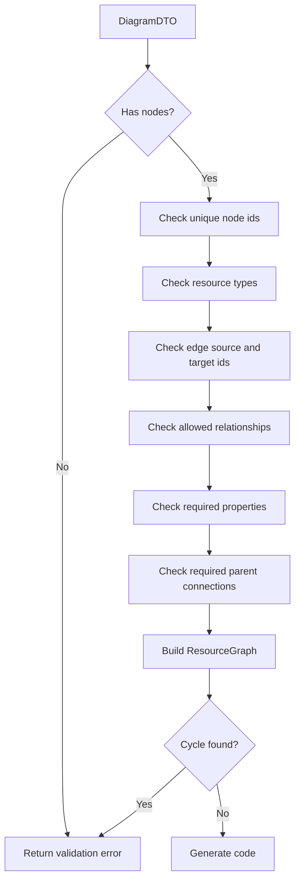
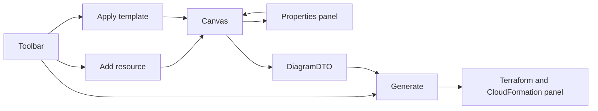

# AWS Builder

AWS Builder is a visual infrastructure builder. The React frontend lets you place AWS resources on a canvas, connect dependencies, edit properties, and generate both Terraform and CloudFormation from the same diagram. The Spring Boot backend validates the diagram, orders resources by dependency, and renders infrastructure code from resource-specific templates.

## What It Does

- Build AWS diagrams with draggable ReactFlow nodes and dependency edges.
- Edit resource properties in a side panel.
- Apply starter templates from the frontend template catalog.
- Validate supported resource types, required properties, parent relationships, and cycles.
- Generate Terraform and CloudFormation output in one request.
- Query a Postgres-backed AWS resource catalog through `/api/config/*`.
- Optionally collect AWS inventory at backend startup when enabled.

## Architecture



## Generation Flow



## Repository Layout

```text
.
+-- backend/                 Spring Boot API, validation, inventory, code generation
|   +-- src/main/java/com/awsBuilder/builder/
|   |   +-- diagram/         Diagram request models, controller, service
|   |   +-- validation/      Resource validation and dependency sorting
|   |   +-- terraform/       Terraform generator and resource templates
|   |   +-- cloudformation/  CloudFormation generator and resource templates
|   |   +-- config/          Catalog API, JPA models, repositories, caching
|   |   +-- inventory/       AWS SDK inventory collection
|   |   +-- tracing/         Trace-aware logging and async execution
|   +-- src/main/resources/  App config, schema.sql, logging config
+-- frontend/                React, TypeScript, Vite, Tailwind, ReactFlow
|   +-- src/components/      Canvas, toolbar, panels, AWS nodes
|   +-- src/services/        API clients and base URL selection
|   +-- src/types/           Diagram/resource types and defaults
|   +-- netlify/functions/   Production backend proxy
+-- docker-compose.yml       Local Postgres database
+-- cloudformation-stack.yaml
```

## Tech Stack

- Frontend: React 18, TypeScript, Vite, Tailwind CSS, ReactFlow, Axios, Lucide icons.
- Backend: Java 17, Spring Boot 3.4, Gradle, Spring Web, JPA/JDBC, Validation, Actuator.
- Data: PostgreSQL locally, H2 for tests.
- AWS: AWS SDK v2 for inventory collection.
- Observability: Micrometer tracing, Brave, JSON Logback, P6Spy SQL logging.

## Local Setup

### Prerequisites

- Java 17
- Node.js and npm
- Docker, for local Postgres
- AWS credentials only if you want real inventory collection

### 1. Start Postgres

```bash
docker compose up -d postgres
```

This starts:

- Database: `terraform_builder`
- User: `builder_user`
- Password: `builder_pass`
- Port: `5432`

The backend initializes tables from `backend/src/main/resources/schema.sql`.

### 2. Start The Backend

```bash
cd backend
./gradlew bootRun
```

Backend URL: `http://localhost:8080`

Useful environment variables:

```bash
SPRING_DATASOURCE_URL=jdbc:p6spy:postgresql://localhost:5432/terraform_builder
SPRING_DATASOURCE_USERNAME=builder_user
SPRING_DATASOURCE_PASSWORD=builder_pass
AWS_INVENTORY_ENABLED=true
AWS_INVENTORY_SYNC_ON_STARTUP=false
AWS_REGION=us-east-1
```

For local development without AWS inventory access, run with:

```bash
AWS_INVENTORY_ENABLED=false ./gradlew bootRun
```

### 3. Start The Frontend

```bash
cd frontend
npm install
npm run dev
```

Frontend URL: `http://localhost:3000`

In development, Vite proxies `/api` to `http://localhost:8080`.

## API Summary

### Generate Code

```http
POST /api/diagrams/generate
Content-Type: application/json
```

Request:

```json
{
  "region": "us-east-1",
  "nodes": [
    {
      "id": "vpc-1",
      "type": "VPC",
      "properties": {
        "cidr_block": "10.0.0.0/16"
      }
    },
    {
      "id": "subnet-1",
      "type": "SUBNET",
      "properties": {
        "cidr_block": "10.0.1.0/24"
      }
    }
  ],
  "edges": [
    {
      "id": "edge-1",
      "source": "subnet-1",
      "target": "vpc-1",
      "type": "dependency"
    }
  ]
}
```

Response:

```json
{
  "terraform": "provider \"aws\" { ... }",
  "cloudformation": "AWSTemplateFormatVersion: '2010-09-09'\n..."
}
```

### Validate Diagram

```http
POST /api/diagrams/validate
```

Returns a validation result or a structured validation error.

### Catalog API

```http
GET /api/config/vpcs?region=us-east-1
GET /api/config/subnets?vpcId=vpc-123&region=us-east-1
GET /api/config/ec2-instances?region=us-east-1
POST /api/config/cache/invalidate
```

Other catalog endpoints include S3, EBS, internet gateways, ALBs, Lambda, DynamoDB, API Gateway, SQS, SNS, Kinesis, CloudWatch, X-Ray, CloudTrail, ECR, ECS, ElastiCache, and EventBridge.

## Supported Resource Types

```text
VPC, SUBNET, EC2, S3, RDS, INTERNET_GATEWAY, LOAD_BALANCER,
LAMBDA, DYNAMODB, API_GATEWAY, SQS, SNS, KINESIS, CLOUDWATCH,
XRAY, CLOUDTRAIL, ECR, ECS, FARGATE, ELASTICACHE, EBS, EFS,
EVENTBRIDGE
```

## Validation And Ordering



Edges are directional. The frontend sends `source` as the dependent resource and `target` as the parent dependency. For example, a subnet connects to a VPC as:

```json
{ "source": "subnet-1", "target": "vpc-1" }
```

## How Code Generation Works

1. `DiagramController` receives `/api/diagrams/generate`.
2. `DiagramService` validates the diagram.
3. `DependencyResolver` builds a `ResourceGraph` and topologically sorts it.
4. `TerraformGenerator` adds AWS provider blocks and renders each node with a `TerraformResource` template.
5. `CloudFormationGenerator` builds a YAML document and merges fragments from `CloudFormationResource` templates.
6. The response contains both generated outputs.

Multi-region Terraform is supported by node-level `region` properties. Nodes using a region different from the primary diagram region receive aliased AWS providers.

## Frontend Behavior



Main frontend files:

- `frontend/src/App.tsx`: application state, history, generation request, layout.
- `frontend/src/components/DiagramCanvas.tsx`: ReactFlow canvas.
- `frontend/src/components/PropertiesPanel.tsx`: selected node editing.
- `frontend/src/components/CodeDisplayPanel.tsx`: generated output display.
- `frontend/src/data/templates.ts`: starter diagrams.
- `frontend/src/types/resources.ts`: default resource properties.

## Production Deployment Notes

The frontend is configured for Netlify:

- Build command: `npm run build`
- Publish directory: `dist`
- Function directory: `netlify/functions`

In production, the frontend calls:

```text
/.netlify/functions/backend-proxy/api
```

Set one of these Netlify environment variables so the proxy can reach the backend:

```bash
BACKEND_URL=https://your-backend-host
EC2_BACKEND_URL=http://your-ec2-host:8080
```

## Testing And Quality

Backend:

```bash
cd backend
./gradlew test
```

Frontend:

```bash
cd frontend
npm run lint
npm run build
```

## Adding A New AWS Resource

1. Add the frontend resource type and defaults in `frontend/src/types`.
2. Add UI support in resource selectors and node rendering if needed.
3. Add backend validation rules in `ValidationEngine`.
4. Add a Terraform template implementing `TerraformResource`.
5. Add a CloudFormation template implementing `CloudFormationResource`.
6. Add or update tests for validation and generated output.

Spring automatically registers generator templates through the template registries, as long as the new template is a Spring component and returns the matching resource type.
